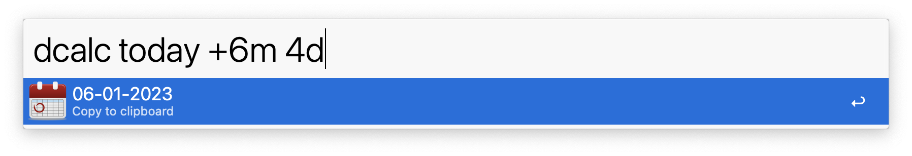

## Date Calculator

Does simple stuff with dates! 🗓️

Original by [@MuppetGate](https://github.com/MuppetGate)
Ported to Python 3 and Alfred 5

<a href="https://github.com/giovannicoppola/alfred-DateCalculator/releases/latest/">
 
</a>

For example, if you enter:

**dcalc 25.12.14 - 18.01.14**

then it will tell you the number of days between those dates. Note that the workflow parses the command as you enter it, so you’ll see _invalid command_, _invalid expression_ and _invalid format_ errors as you type. Once you’ve completed the command then you’ll be given the result.

You could also try

**dcalc 25.12.14 - now**

for the number of days until Christmas. (Always seems so far away . . .)

Maybe you don’t want it in days, but would rather it in weeks:

**dcalc 25.12.14 - now w**

or days and weeks

**dcalc 25.12.14 - now wd**

or years, months, weeks and days

**dcalc 25.12.14 - now ymwd**

or

**dcalc 25.12.14 - now long**

will do the same thing. Personally, I always use the _long_ format because it’s more accurate.

For those who like to look ahead, you can add days to a date

**dcalc now + 6d**

or weeks

**dcalc 18.12.14 + 9w**

or combine ‘em

**dcalc 18.12.12 + 5y 9d 3w - 2d + 1d 1w**

What does that mess do?
- Take the date 18.12.12 
- Add 5 years
- Add another 9 days
- Add another 3 weeks
- Then take off 2 days
- Add another 1 day
- And then add another 1 week

If you want to know what week number you’re in, then try this:

**dcalc today wn**

Or for a specific date:

**dcalc 25.12.14 wn**

The **wn** function also works in reverse, finding dates from week numbers:

**dcalc wn 2015 5**

will give you the date for the fifth week inside for 2015. The expression will give you the date on Monday of that week, but you can also supply your own day adjustment if you want to.

**dcalc wn 2015 5 sun**

And of course, you can do some basic calculations, if you can stand the syntax!

**dcalc wn 2015 6 tue +1d wd**

Should give you the Tuesday for week 6 in the year 2015, then add 1 day to that and give back the day of week.
Which is Wednesday, obviously :-)

I've included defaults so that the workflow will fill in missing parameters:

**dcalc wn 7**

will return the date of the current day of week (Monday, as I'm writing this) for the seventh week of the current year.

You can also use the _today_ thing in other places too:

**dcalc today + 4d**

And we have another thing called _time_ because the workflow can handle times too:

**dcalc time + 6h 8M**

will add 6 hours and 8 minutes to the current time. Note the capital ‘M’ to denote minutes. Odd, I know . . .  sorry, but the workflow has to distinguish between this and a small ‘m’ (for months). I figured make this one a capital because it would see much less use. (It has for me.)

If you just want the current time, then just enter

**dcalc time**

Here’s another time calculation
**dcalc 14:35 + 6h**

That’s the time 6 hours from now, and for real nerdiness:

**dcalc 21.06.14@14:20 - 23.01.12@09:21 long**

Probably not all that useful, but some of this other stuff might be. You know all about

**dcalc now**

For giving you the current time and date. While you can use 

**dcalc tomorrow**

for tomorrow’s date, and as you would expect

**dcalc tomorrow + 1d**

will give you the day after tomorrow.

**dcalc next tue**

will give you the date next Tuesday. Or for for Thursday you could enter

**dcalc next tue + 2d**

if you’re still a little too inebriated to realise that

**dcalc next thu**

will give you the same answer.

That about covers it, I think. I haven’t done anything clever with locales, but you can pick a different date format with

**dcalcset date format**

And we also support both 12-hour and 24-hour time formats. 

**dcalcset time format**

I would recommend sticking with the 24-hour format; it's a lot easier to type because the AM/PM symbols have to be in upper case.

You can also set the combined date and time format using:

**dcalcset date and time format**

If you’re ever puzzled by _invalid command_ or _invalid expression_ errors, then start with the settings; they might be set incorrectly.

Oh, almost forgot.

**dcalc easter**

Is the date for next Easter Sunday, for no other reason that I can never remember it, and now there’s an easy way to find out how many days until Christmas:

**dcalc today - christmas**

And to celebrate finishing my new book, I decided to add:

**dcalc passover**

## Alternative parser
If surround a simple expression in double quotes, then something quite magical happens:

**dcalc "4 hours 8 minutes after 4pm"**

or

**dcalc "6 weeks and 4 days after next wednesday"**

or

**dcalc "1 day after tomorrow"**

Yup! A natural date language parser! 

You can even combine it with the existing parser:

**dcalc "next friday" + 1d**

This is a little bit experimental (I might drop it later if it proves to be problematic), but I thought I'd throw it in for a bit of a fun.

## Abbreviations
To speed up entering calculations, there are a couple of function abbreviations you can use within expressions:

**<** yesterday

**\*** today

**\>** tomorrow

**&** time

**\#** now

So now

**dcalc \*** 

will give you the current date.

And

**dcalc \*+6d**

will give you the date six days from now.

### Credits
A list of things that made my first attempt at Python programming possible:
- Dean Jackson for his more-than-slightly awesome [Alfred Workflow framework](http://www.deanishe.net/alfred-workflow/), and for his ‘parse-as-you-type’ idea.
- The folk at [Jetbrains](http://www.jetbrains.com/pycharm/), for making programming, in any language, bearable.
- Peter Odding for writing [HumanFriendly](https://humanfriendly.readthedocs.org/en/latest/).
- Gustavo Niemeyer for [Python-DateUtil](https://labix.org/python-dateutil).
- Volker Birk for [PyPEG](http://fdik.org/pyPEG/).
- Mike Taylor for [ParseDateTime](https://github.com/bear/parsedatetime).
- [Programming Praxis](http://programmingpraxis.com) for the Passover calculation.

- And finally, and by no means least – Mr Smirnoff for discovering how to bottle patience.

### Version History
4.1 Alfred 5 version
4.0.1 added new date format (`d.m.yyyy`)
4.0 ported to Python 3

### License
Well, I guess the [MIT](http://opensource.org/licenses/MIT) one will do. :-)

The MIT License (MIT)
Copyright (c) 2014 MuppetGate Media
Copyright (c) 2022 Giovanni Coppola

Permission is hereby granted, free of charge, to any person obtaining a copy
of this software and associated documentation files (the "Software"), to deal
in the Software without restriction, including without limitation the rights
to use, copy, modify, merge, publish, distribute, sublicense, and/or sell
copies of the Software, and to permit persons to whom the Software is
furnished to do so, subject to the following conditions:

The above copyright notice and this permission notice shall be included in
all copies or substantial portions of the Software.

THE SOFTWARE IS PROVIDED "AS IS", WITHOUT WARRANTY OF ANY KIND, EXPRESS OR
IMPLIED, INCLUDING BUT NOT LIMITED TO THE WARRANTIES OF MERCHANTABILITY,
FITNESS FOR A PARTICULAR PURPOSE AND NON-INFRINGEMENT. IN NO EVENT SHALL THE
AUTHORS OR COPYRIGHT HOLDERS BE LIABLE FOR ANY CLAIM, DAMAGES OR OTHER
LIABILITY, WHETHER IN AN ACTION OF CONTRACT, TORT OR OTHERWISE, ARISING FROM,
OUT OF OR IN CONNECTION WITH THE SOFTWARE OR THE USE OR OTHER DEALINGS IN
THE SOFTWARE.

